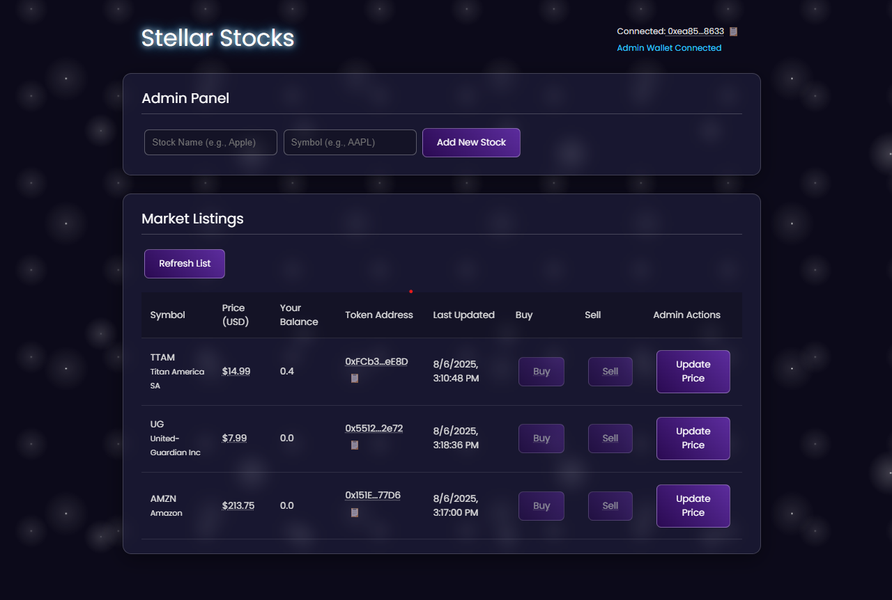

# 🚀 Decentralized Stock Market dApp

Welcome to our **Decentralized Stock Market**, a full-stack decentralized application (dApp) that brings the thrill of stock trading to the Ethereum blockchain! Deployed on the Sepolia testnet, this project combines robust Solidity smart contracts, real-time price feeds via Chainlink oracles, and a sleek, user-friendly React frontend. Whether you're a blockchain developer or just curious, this dApp showcases how to bridge real-world data with on-chain logic in a secure and interactive way.

  

## 🌟 What Makes This Project Awesome?

This dApp lets users buy and sell tokenized stocks (ERC20 tokens) using LINK as the payment currency, built for our *Fundamentals of Cryptocurrencies* course. It’s packed with features that make it both functional and fun to explore:

- **Smart Contracts (`/contracts`):**
  - **Factory Pattern Magic:** The `StockMarket.sol` contract dynamically deploys unique `StockToken.sol` ERC20 contracts for each stock (e.g., Google’s “GOOGL”).
  - **Real-Time Price Feeds:** Integrates Chainlink’s Any API (Job ID: `0x73744237c569436394553b9a76de202f`) to fetch live stock prices from Alphavantage, with a 0.1 LINK fee per request.
  - **Secure Design:** Uses OpenZeppelin’s `Ownable` for admin-only controls and the CEI (Check-Effects-Interactions) pattern to prevent reentrancy attacks.
  - **Price Timeout:** Enforces a configurable validity period (default: 3600 seconds) to ensure trades use fresh prices.

- **Frontend (`/ui`):**
  - **Stellar UI Design:** A modern, glassy, space-themed interface with the custom Panton font, fully responsive for desktop and mobile.
  - **Web3 Integration:** Connects to MetaMask for wallet interactions, showing your address, LINK balance, and stock holdings.
  - **Rich Features:** Includes an admin panel for owners to add stocks and request price updates, plus a modal for buying/selling with react-toastify notifications.
  - **User-Friendly Touches:** Copy-to-clipboard buttons for addresses, tooltips, and warnings for outdated prices to enhance the experience.

- **Payment Token:** Uses LINK (`0x779877A7B0D9E8603169DdbD7836e478b4624789` on Sepolia) for both oracle fees and trading, ensuring seamless integration with Chainlink and ERC20 compatibility.

## 🛠️ Tech Stack

- **Backend:**
  - **Solidity** (^0.8.9): For secure and efficient smart contracts.
  - **OpenZeppelin**: For trusted ERC20 and Ownable implementations.
  - **Chainlink Any API**: For real-world stock price feeds.
- **Frontend:**
  - **React + Vite**: For a fast, modern UI development experience.
  - **ethers.js**: For seamless blockchain interactions.
  - **react-toastify**: For sleek transaction notifications.
  - **Tailwind CSS**: For styling with a glassy, space-themed aesthetic.
- **Tools:**
  - **Remix IDE**: For contract development and deployment.
  - **MetaMask**: For wallet integration and Sepolia interactions.
  - **Etherscan**: For transaction verification and debugging.
  - **Infura**: For reliable RPC endpoints.

## ✨ Core Features in Action

Here’s what you can do with this dApp:

- **Add Stocks (Admin):** Owners can add new stocks (e.g., “Google” with symbol “GOOGL”), deploying a new ERC20 token contract.
- **Fetch Real-Time Prices:** Owners trigger price updates via Chainlink, storing prices and timestamps on-chain.
- **Buy & Sell Stocks:** Users trade tokenized stocks with LINK using secure approve/transferFrom mechanics.
- **View Portfolio:** The UI shows your wallet address, LINK balance, stock holdings, and details like price and last update.
- **Stay Secure:** Admin functions are owner-only, and trades are blocked if prices are outdated.

## 🧪 Testing the dApp

We thoroughly tested the dApp on Sepolia to ensure rock-solid functionality. Here’s how we validated it:

1. **Funded the Contract with LINK:**
   - Copied the `StockMarket` contract address from Remix.
   - Sent 1 LINK to it via MetaMask (LINK address: `0x779877A7B0D9E8603169DdbD7836e478b4624789`).
   - Verified the 1 LINK balance on Etherscan’s “Tokens” tab.

2. **Configured Contract Settings:**
   - Set `setPaymentToken` with the LINK address to use it for trades.
   - Configured `setChainlinkDetails` with Job ID `0x73744237c569436394553b9a76de202f` and a 0.1 LINK fee.
   - Confirmed transactions on Etherscan with “Contract Call” entries.

3. **Added a Stock:**
   - Called `addStock` with “Google” and “GOOGL” to deploy a `StockToken` contract.
   - Found the `StockAdded` event in Remix logs, copied the new token address, and verified it on Etherscan.

4. **Requested & Verified Price Updates:**
   - Called `requestPriceUpdate` for “GOOGL”, deducting 0.1 LINK (confirmed on Etherscan).
   - After 1-2 minutes, checked the `stocks` mapping in Remix, confirming a non-zero price (8 decimals) and recent timestamp.

5. **Bought & Sold Stocks:**
   - **Buy:** Approved 10 LINK for `StockMarket` via the LINK contract’s `approve`, then called `buyStock` for 1 GOOGL. MetaMask showed LINK deducted and GOOGL added.
   - **Sell:** Approved 1 GOOGL token, then called `sellStock`. MetaMask showed GOOGL removed and LINK returned.
   - Etherscan logs showed `PriceUpdated` events and token transfers.

These tests confirmed that our dApp meets all requirements, from contract logic to real-world interactions.

## 🚀 Getting Started

Ready to explore the stock market on-chain? Follow these steps to run the dApp locally:

### Prerequisites
- [Node.js](https://nodejs.org/) (v18+)
- [MetaMask](https://metamask.io/) browser extension, set to Sepolia testnet
- Sepolia ETH (for gas) and LINK tokens (for oracle fees) — grab some from a Sepolia faucet
- A code editor like VS Code

### Installation & Setup

1. **Clone the Repository:**
   ```sh
   git clone [Your Repository URL Here]
   cd decentralized-stock-market
   ```

2. **Install Frontend Dependencies:**
   ```sh
   cd ui
   npm install
   ```

3. **Configure the Contract Address:**
   - Open `ui/src/App.jsx`.
   - Replace the `contractAddress` with your deployed `StockMarket.sol` address (e.g., `0x27c8C94374C8B64D25AC1F1369e5b472F4fD6981`, `my stock market(:` ).

4. **Run the Frontend:**
   ```sh
   npm run dev
   ```
   - Open your browser to the local URL (e.g., http://localhost:5173).
   - Connect MetaMask and start trading!

5. **Deploy Contracts (Optional):**
   - Open Remix IDE, load `StockMarket.sol` and `StockToken.sol` from `contracts/`.
   - Compile with Solidity ^0.8.9 and deploy to Sepolia.
   - Fund the contract with 1 LINK and configure it as described in the testing section.

## 📂 Project Structure

```
/contracts:
  StockMarket.sol: Core contract for stock management, oracle integration, and trading.
  StockToken.sol: ERC20 token contract for each stock.
  TestStockMarket.sol: Unit tests for contract validation.

/ui:
  src/App.jsx: Main React component with Web3 logic and UI.
  src/StockMarketABI.json: ABI for interacting with the deployed contract.
  public/: Static assets like the screenshot.
```

## 🌍 Deployed Info

- Network: Sepolia Testnet
- StockMarket Contract Address: [Insert your deployed address here]
- Etherscan Link: [Insert Etherscan URL here]
- Example StockToken (GOOGL) Address: [Insert GOOGL token address here]
- Etherscan Link: [Insert Etherscan URL here]

## 🙌 Contributing

We’d love your input! Fork the repo, submit pull requests, or open issues for bugs or feature ideas. If you’re tinkering with the code, test on Sepolia and share Etherscan transaction links for verification.

## 📜 License

This project is licensed under the MIT License — see the LICENSE file for details.

Built with ☕ and passion by [Your Names Here] for the Fundamentals of Cryptocurrencies course, Spring 2025.
